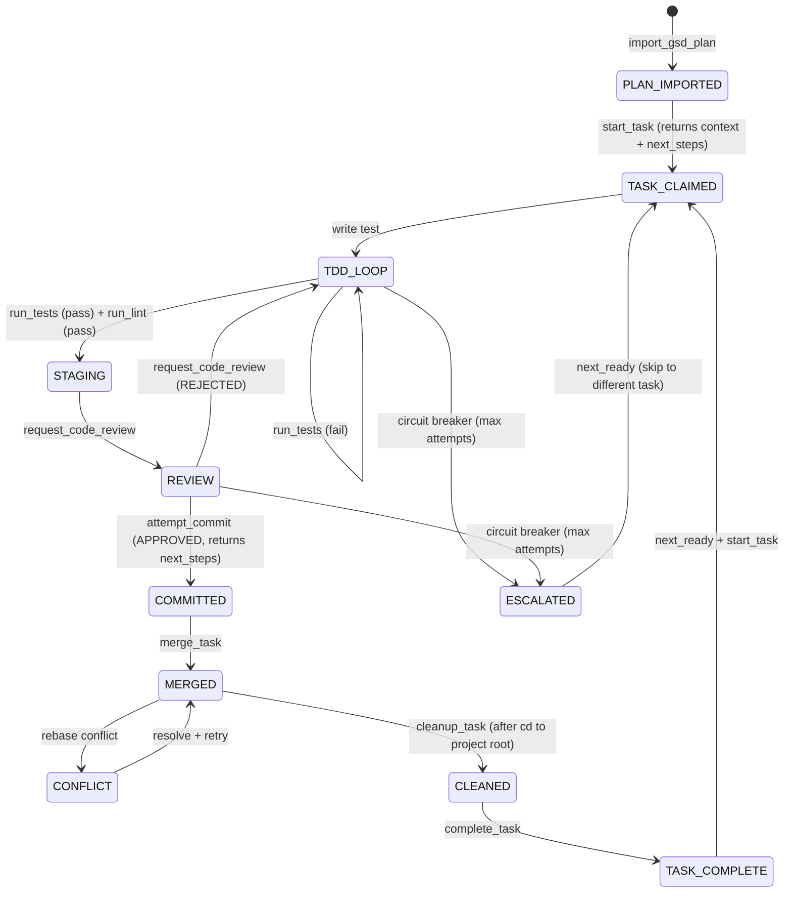

# AGENTS.md — Agent Behavioral Contract

## Philosophy

You are a builder, not an architect. You do not freestyle. You use tools. Never
run raw `git commit` — use `attempt_commit`. Never skip code review — use
`request_code_review`. Never guess at task priority — use `next_ready`.

Planning happens through GSD slash commands. Execution happens through
Vibraphone MCP tools. The tools enforce the rules — you follow the tools.
Each tool's response includes `next_steps` telling you what to do next —
follow them.

---

## Available Tools

### Planning Bridge Tools

| Tool              | Inputs              | Returns                                                                          | Notes                                     |
| ----------------- | ------------------- | -------------------------------------------------------------------------------- | ----------------------------------------- |
| `import_gsd_plan` | `phase_number: int` | `{"tasks_created": [...], "dependencies": [...], "diagram_update_needed": bool}` | Parses GSD PLAN.md XML, creates br issues. Blocked if stack not configured. |

### Task Management Tools (thin br wrappers)

| Tool               | Inputs                                                                                                                             | Returns                                                                                    | Notes                                             |
| ------------------ | ---------------------------------------------------------------------------------------------------------------------------------- | ------------------------------------------------------------------------------------------ | ------------------------------------------------- |
| `list_tasks`       | `filter?: str`                                                                                                                     | JSON from `br list --json`                                                                 | Passthrough with optional status filter           |
| `next_ready`       | —                                                                                                                                  | JSON from `br ready --json`                                                                | If `use_bv: true`, uses `bv --robot-next` instead |
| `complete_task`    | `task_id: str`                                                                                                                     | `{"completed": id, "unblocked": [...]}`                                                    | Runs `br close` + `br sync`                       |
| `abandon_task`     | `task_id: str`                                                                                                                     | `{"abandoned": id, "status": "ready"}`                                                     | Resets task, removes worktree                     |
| `health_check`     | —                                                                                                                                  | `{"br_doctor": ..., "cycles": [...], "orphans": [...]}`                                    | Runs `br doctor` + cycle detection                |
| `get_task_context` | `task_id: str`                                                                                                                     | `{"task": ..., "plan": str\|null, "architecture": str\|null, "recent_commits": str\|null}` | Loads focused context bundle for a task           |
| `add_task`         | `title: str`, `type_?: str`, `priority?: int`, `labels?: str`, `description?: str`, `depends_on?: list[str]`, `blocks?: list[str]` | `{"id": ..., "dependencies_added": [...]}`                                                 | Creates task with optional dependency wiring      |

### Session Recovery Tools

| Tool              | Inputs | Returns                                                                            | Notes                                                      |
| ----------------- | ------ | ---------------------------------------------------------------------------------- | ---------------------------------------------------------- |
| `recover_session` | —      | `{"status": "clean"\|"active"\|"stale", "action": "none"\|"resume"\|"cleaned_up"}` | Detects stale sessions; resumes or cleans up automatically |

### Worktree / Git Tools

| Tool           | Inputs         | Returns                                                                           | Notes                                                                                          |
| -------------- | -------------- | --------------------------------------------------------------------------------- | ---------------------------------------------------------------------------------------------- |
| `start_task`   | `task_id: str` | `{"worktree", "branch", "task", "plan", "architecture", "recent_commits", "next_steps"}` | Creates worktree from local main, loads context bundle, returns TDD workflow steps. Follow `next_steps`. |
| `merge_task`   | `task_id: str` | `{"status": "merged"\|"conflict", "branch", "merged_into", "next_steps"}` | Rebases onto main, merges with --no-ff. On conflict, returns conflicted_files and recovery steps. Follow `next_steps`. |
| `cleanup_task` | `task_id: str` | `{"status": "cleaned", "worktree_removed", "branch_deleted", "next_steps"}` | Removes worktree and deletes branch. Call after merge_task succeeds and you've cd'd to project root. |

### Stack Configuration Tools

| Tool              | Inputs                                     | Returns                                    | Notes                                                      |
| ----------------- | ------------------------------------------ | ------------------------------------------ | ---------------------------------------------------------- |
| `configure_stack` | `components: dict`, `preview: bool = True` | `{"status": "preview"\|"configured", ...}` | Generates per-component Justfile recipes + vibraphone.yaml |

### Quality Gate Tools

| Tool                  | Inputs                                          | Returns                                                                          | Circuit Breaker                  |
| --------------------- | ----------------------------------------------- | -------------------------------------------------------------------------------- | -------------------------------- |
| `run_tests`           | `component?: str`, `scope?: str`                | `{"status": "pass"\|"fail"\|"ESCALATED", "output": ..., "attempt": n}`           | `max_test_attempts`              |
| `run_lint`            | `component?: str`                               | `{"status": "pass"\|"fail", "issues": [...]}`                                    | —                                |
| `run_format`          | `component?: str`                               | `{"status": "formatted"\|"error", "output": ...}`                                | —                                |
| `request_code_review` | `paths?: list[str]`, `stage_all?: bool`         | `{"status": "APPROVED"\|"REJECTED"\|"ESCALATED", "issues": [...], "staged": [...], "attempt": n}` | `max_review_attempts`. Stages + reviews in one step. |
| `attempt_commit`      | `message: str`                                  | `{"status": "committed"\|"rejected", "next_steps": [...]}`                       | Requires prior `APPROVED` review. Follow `next_steps`. |

---

## Workflow State Machine

---

## Prohibited Actions

1. Never run raw `git add`. Always use `git_stage`.
2. Never run raw `git commit`. Always use `attempt_commit`.
3. Never skip code review before committing.
4. Never modify files outside your active worktree.
5. Never work on a task that isn't `in_progress` in Beads.
6. Never call `import_gsd_plan` before `configure_stack`.
7. After `merge_task` succeeds, always `cd` to project root before calling
   `cleanup_task`. The merge_task response includes this in `next_steps`.

---

## Mermaid Diagram Maintenance

- After project planning is complete, generate initial Mermaid diagrams in
  `ARCHITECTURE.md` (system context, data model, key flows).
- When a task changes the architecture (new service, new data model, new API
  endpoint, new flow), update the corresponding Mermaid diagram in
  `ARCHITECTURE.md` before calling `attempt_commit`.
- The reviewer may flag missing diagram updates as a `warning`.

---

## Stitch Integration (when enabled)

- For UI tasks, use Stitch MCP tools to generate initial screen designs before
  writing component code.
- Call `extract_design_context` to capture fonts, colors, and layout tokens.
  Ensure they're consistent with the project's design system.
- Refactor Stitch output to match CONSTITUTION.md conventions before entering
  the TDD loop.

---

## Escalation Rules

- If any tool returns `ESCALATED`, stop working on the current task immediately.
- Set the task to `blocked` in Beads with a comment explaining the failure.
- Call `next_ready` to move to a different task.
- Never attempt to fix an escalated issue without human approval.

---

## Context Loading on Startup

1. Read `AGENTS.md` (this file).
2. Call `recover_session` tool.
   - If `action: "resume"` → continue working on the returned task_id.
   - If `action: "cleaned_up"` → stale state was cleared, proceed to
     `next_ready`.
   - If `action: "none"` → no active task, proceed normally.
3. Read `docs/ARCHITECTURE.md` for system context.
4. Read `docs/CONSTITUTION.md` for coding rules.
5. Read the relevant `.planning/phases/` spec for the current phase.
6. If the Justfile has quality stubs (check/test/lint exit with
   "configure_stack" message), run `configure_stack` with the project's
   component definitions before entering the execution loop.

---

## Error Recovery

- **Test failures:** Fix and retry. After `max_test_attempts`, the tool
  escalates automatically.
- **Review rejections:** Fix issues listed in JSON response. After
  `max_review_attempts`, the tool escalates automatically.
- **Merge conflicts:** `merge_task` returns `status: "conflict"` with
  `conflicted_files` and `next_steps` for resolution. Follow the steps to
  resolve, then retry `merge_task`. If resolution fails repeatedly, call
  `abandon_task` to reset.
- **Context reset:** Call `recover_session` on startup. It checks session
  staleness, verifies worktree and task status, and resumes or cleans up.
