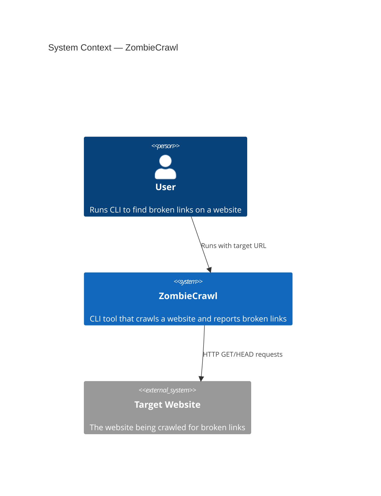
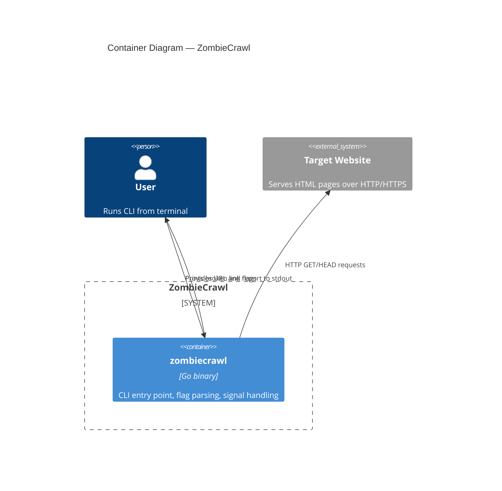
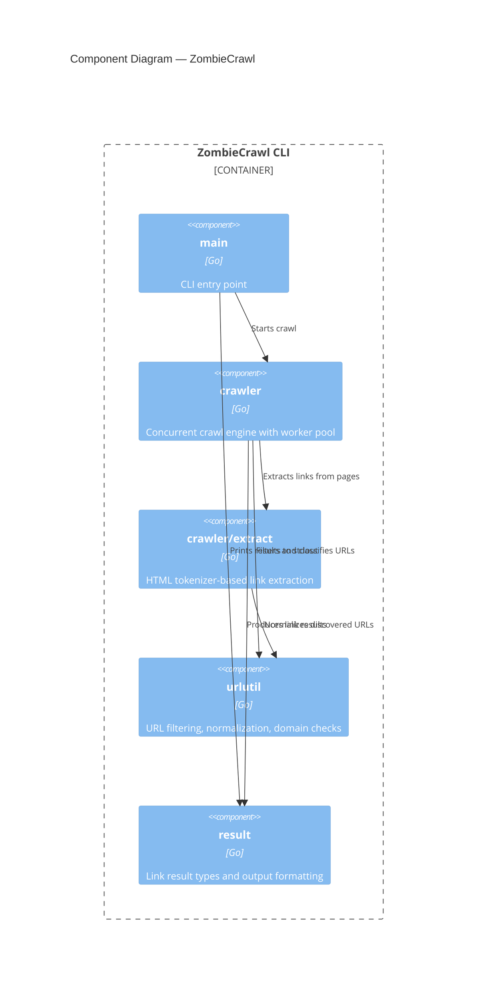
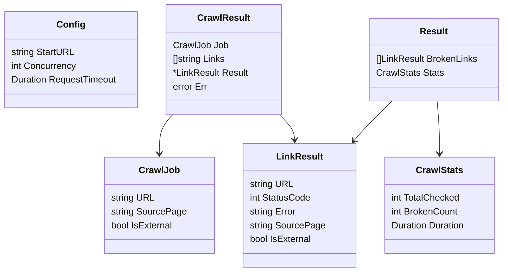
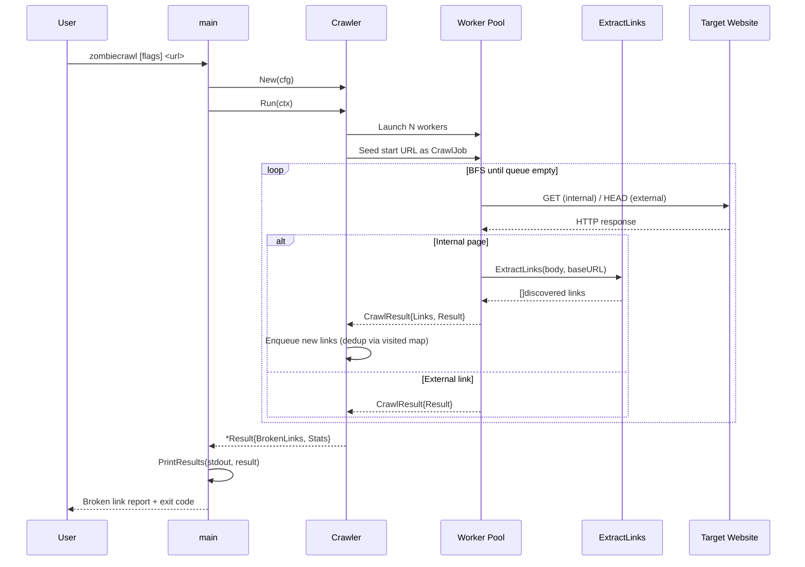

# ARCHITECTURE.md — Visual Source of Truth

Mermaid diagrams that give the agent a compressed understanding of the system
without reading every file. Diagrams are generated incrementally as the project
grows.

---

## When Diagrams Are Created and Updated

| Trigger                     | Action                                                                                |
| --------------------------- | ------------------------------------------------------------------------------------- |
| `gsd:new-project` completes | Agent generates initial system context + data model diagrams                          |
| `import_gsd_plan` runs      | Bridge tool checks if phase introduces new components; flags diagram update needed    |
| `complete_task` runs        | Agent updates diagrams if task changed architecture (enforced by AGENTS.md directive) |
| `request_code_review` runs  | Reviewer checks for missing diagram updates per CONSTITUTION.md rules                 |

---

## System Context (C4 Level 1)

External systems and boundaries.

---

## Container Diagram (C4 Level 2)

Services, processes, and communication.

---

## Component Diagram (C4 Level 3)

Internal structure per container.

---

## Data Model

Core types and their relationships (no database — all in-memory).

---

## Key Sequence Diagrams

### Crawl Flow

