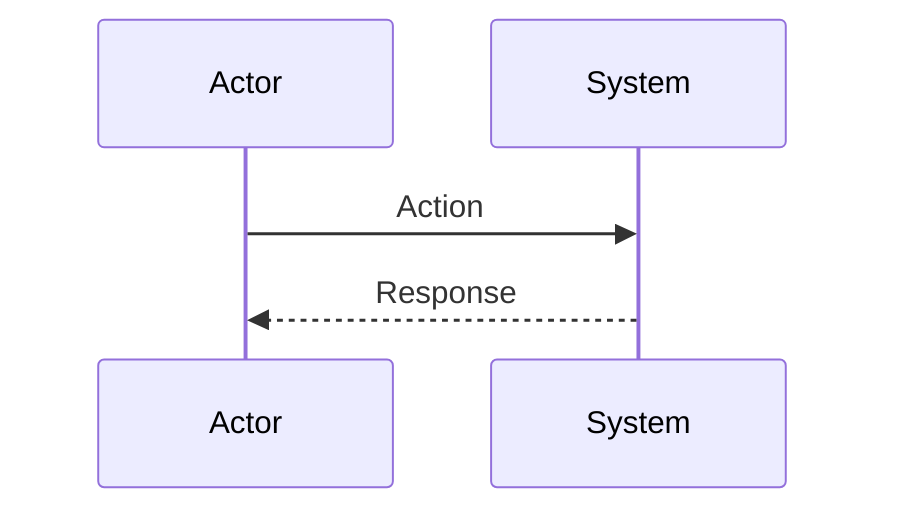
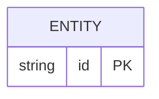

# Feature: [Name]

## Status: [Draft | Approved | In Progress | Complete]

## Problem Statement

## User Story

As a [role], I want [action], so that [benefit].

## Acceptance Criteria

- [ ] ...

## Logic Flow

## Data Model Changes

## Open Questions

## Approved By: [Name/Date]
